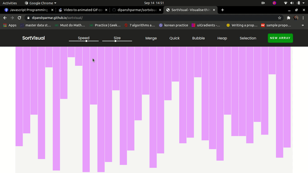

# SortVisual

SortVisual is a web app to visualize various sorting algorithms. This web app can visualize Bubble Sort, Selection Sort, Merge Sort, Heap Sort and Quick Sort. The web app is written in HTML, CSS and Vanilla JavaScript.

## Demo

## How to access?
Click [here](https://dipanshparmar.github.io/sortvisual) to visit the SortVisual.

## License
SortVisual is licensed under the [AGPL-3.0 License](./LICENSE)
